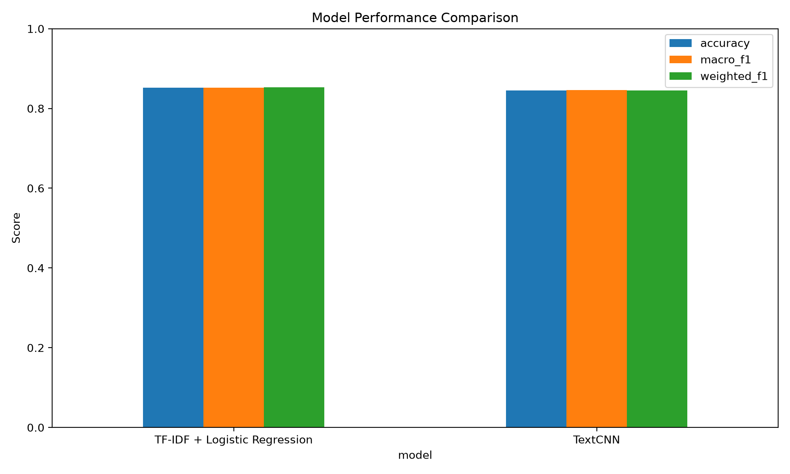
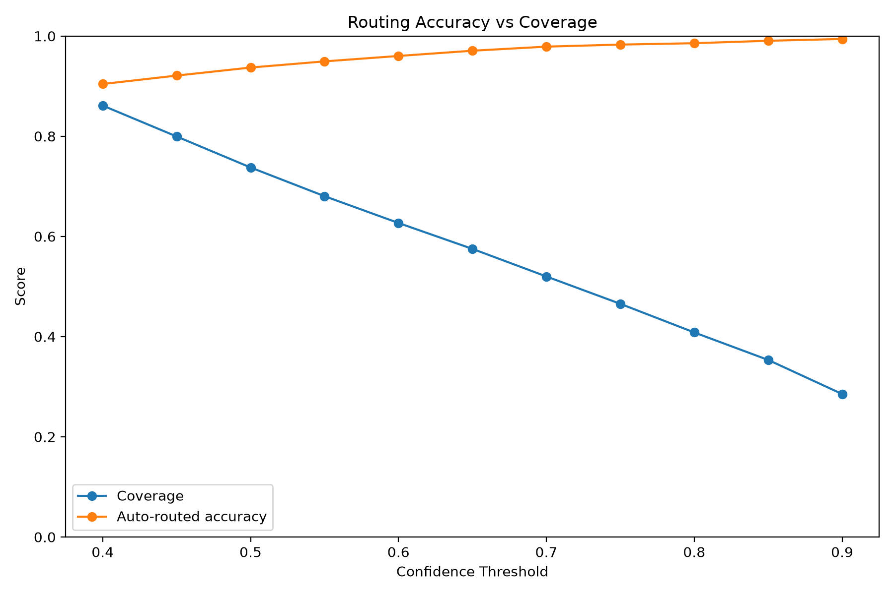
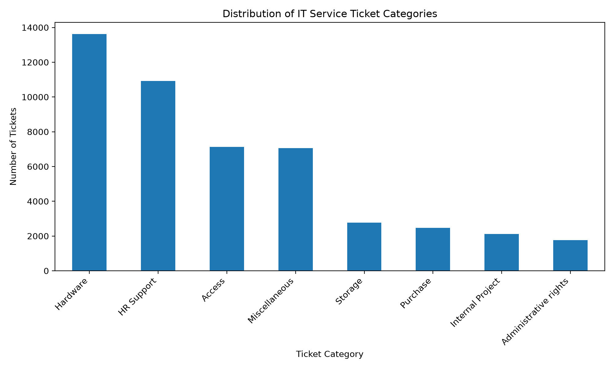
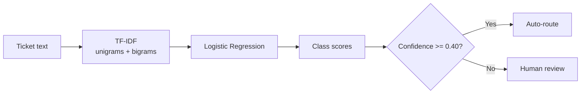

# IT Service Ticket Classification & Confidence-Based Routing

An end-to-end NLP project for classifying IT service desk tickets into eight support categories and routing low-confidence cases to human review. The project compares a classical **TF-IDF + Logistic Regression** pipeline with a **PyTorch TextCNN**, then serves the selected production model through FastAPI.

The production model is intentionally the simpler one: Logistic Regression slightly outperformed TextCNN on the held-out test set while also delivering a better confidence-routing trade-off.

## Why this project is useful

- Automates routing across **8 IT support categories**.
- Uses a **47,837-ticket** public dataset with a stratified 70/15/15 train-validation-test split.
- Compares a strong classical NLP baseline against a neural text classifier instead of assuming the more complex model is better.
- Selects the confidence threshold on the **validation set**, keeping the test set for final evaluation.
- Escalates uncertain tickets to human review rather than forcing every prediction.
- Exposes inference through **FastAPI** with health checks, top-3 predictions, confidence, and a manual-review flag.
- Includes automated API tests and saved evaluation reports/figures.

## Results

### Classification

| Model | Accuracy | Macro F1 | Weighted F1 |
|---|---:|---:|---:|
| **TF-IDF + Logistic Regression** | **85.20%** | **85.19%** | **85.30%** |
| TextCNN | 84.88% | 85.01% | 84.94% |



Logistic Regression was selected using validation-set routing coverage, subject to at least 90% accuracy on automatically routed tickets. The selected model was then evaluated on the held-out test set.

### Confidence-based routing

The production threshold is selected on the validation set by requiring at least **90% accuracy among automatically routed tickets**, then choosing the qualifying threshold with the highest coverage.

For Logistic Regression, the selected threshold is **0.40**.

| Test-set routing metric | Result |
|---|---:|
| Overall accuracy | 85.20% |
| Auto-route coverage | **85.62%** |
| Accuracy on auto-routed tickets | **90.67%** |
| Manual-review rate | 14.38% |
| Auto-routed tickets | 6,144 / 7,176 |



This converts the classifier into a simple human-in-the-loop routing system: high-confidence tickets are routed automatically, while lower-confidence cases are flagged for manual review.

## Dataset

The project uses the [IT Service Ticket Classification Dataset](https://www.kaggle.com/datasets/adisongoh/it-service-ticket-classification-dataset).

Expected columns:

- `Document` — service ticket text
- `Topic_group` — target support category

Categories:

- Access
- Administrative rights
- Hardware
- HR Support
- Internal Project
- Miscellaneous
- Purchase
- Storage

The raw CSV is intentionally excluded from Git. Download it and place it at:

```text
data/raw/all_tickets_processed_improved_v3.csv
```

The category distribution is imbalanced, which is why model comparison includes **Macro F1** in addition to overall accuracy.



## How it works



The experimental TextCNN uses learned embeddings, parallel 1D convolutions with kernel sizes 3/4/5, global max pooling, dropout, and a linear classifier.

## Repository structure

```text
.
├── app/
│   └── main.py                     # FastAPI application
├── artifacts/
│   ├── baseline.joblib             # Local trained baseline model
│   └── cnn/                        # CNN config, vocabulary, labels, weights
├── data/
│   └── raw/                        # Dataset location (CSV ignored by Git)
├── notebook/                       # Exploratory notebooks
├── reports/
│   ├── data/                       # Persisted split manifests
│   ├── figures/                    # Generated plots
│   └── metrics/                    # Metrics, thresholds, predictions
├── src/
│   ├── data.py                     # Loading, deduplication, stratified splitting
│   ├── evaluate.py                 # Shared classification & calibration metrics
│   ├── routing_utils.py            # Bootstrap CI for routing evaluation
│   ├── train_baseline.py           # TF-IDF + Logistic Regression training
│   ├── evaluate_val_baseline.py    # Baseline validation predictions
│   ├── analyze_threshold_baseline.py
│   ├── evaluate_routing_baseline.py
│   ├── evaluate_baseline.py        # Baseline test evaluation
│   ├── cnn_data.py                 # CNN tokenization/vocabulary/dataset
│   ├── textcnn.py                  # TextCNN architecture
│   ├── train_cnn.py                # TextCNN training + early stopping
│   ├── evaluate_cnn.py             # TextCNN test evaluation
│   ├── evaluate_val_cnn.py         # TextCNN validation predictions
│   ├── analyze_threshold_cnn.py    # CNN threshold analysis
│   ├── compare_models.py           # Model comparison table
│   ├── select_model.py             # Automated production model selection
│   ├── error_summary.py            # CNN error analysis
│   ├── plot_results.py             # README/report figures
│   └── inference.py                # Baseline/CNN prediction backends
├── tests/
│   ├── test_api.py                 # FastAPI unit tests
│   └── test_integration.py         # ML pipeline integration tests
├── .github/
│   └── workflows/ci.yml            # GitHub Actions CI
├── .gitignore
├── pyproject.toml                  # Ruff / pytest configuration
├── requirements.txt                # CPU dependencies
└── requirements-cuda.txt           # GPU/CUDA override
```

Model binaries (`*.joblib`, `*.pt`) and the raw dataset are ignored by Git, so a fresh clone should train the desired backend before starting the API.

## Getting started

### 1. Clone the repository

```bash
git clone <YOUR_REPOSITORY_URL>
cd it-ticket-classification
```

### 2. Create a virtual environment

Windows PowerShell:

```powershell
py -m venv .venv
.\.venv\Scripts\Activate.ps1
```

macOS/Linux:

```bash
python -m venv .venv
source .venv/bin/activate
```

### 3. Install dependencies

The codebase requires NumPy, pandas, scikit-learn, joblib, Matplotlib, PyTorch, FastAPI, Uvicorn, and pytest.

```bash
pip install -r requirements.txt
```

For GPU/CUDA environments, install with the CUDA override instead:

```bash
pip install -r requirements-cuda.txt --extra-index-url https://download.pytorch.org/whl/cu126
```

### 4. Add the dataset

Download the Kaggle dataset and place the CSV at:

```text
data/raw/all_tickets_processed_improved_v3.csv
```

### 5. Train the production model

```bash
python -m src.train_baseline
```

This creates the local artifact:

```text
artifacts/baseline.joblib
```

### 6. Reproduce threshold selection

Generate validation predictions and choose the routing threshold:

```bash
python -m src.evaluate_val_baseline
python -m src.analyze_threshold_baseline
```

The selected threshold is stored in:

```text
reports/metrics/baseline_selected_threshold.json
```

### 7. Evaluate final routing performance

```bash
python -m src.evaluate_routing_baseline
```

## Run the API

The API uses the Logistic Regression backend by default.

```bash
python -m uvicorn app.main:app --reload
```

Open the interactive API documentation at:

```text
http://127.0.0.1:8000/docs
```

Health check:

```text
GET /health
```

Prediction endpoint:

```text
POST /predict
```

Example request:

```json
{
  "text": "I cannot access my account and need my password reset"
}
```

Example response shape:

```json
{
  "category": "Access",
  "confidence": 0.99,
  "threshold": 0.4,
  "needs_manual_review": false,
  "top_3": [
    {"category": "Access", "probability": 0.99},
    {"category": "Hardware", "probability": 0.01},
    {"category": "Storage", "probability": 0.0}
  ]
}
```

The API validates ticket length, returns the three highest-scoring categories, and flags predictions whose confidence is below the selected threshold.

## Optional: run the TextCNN experiment

Train the neural model:

```bash
python -m src.train_cnn
```

Evaluate it on the test split:

```bash
python -m src.evaluate_cnn
```

Generate validation predictions:

```bash
python -m src.evaluate_val_cnn
```

After both model metrics are available, compare them with:

```bash
python -m src.compare_models
```

The CNN can also be served by setting `MODEL_BACKEND=cnn` before starting Uvicorn.

PowerShell:

```powershell
$env:MODEL_BACKEND="cnn"
python -m uvicorn app.main:app --reload
```

macOS/Linux:

```bash
MODEL_BACKEND=cnn python -m uvicorn app.main:app --reload
```

## Generate reports

Create the error summary after CNN evaluation:

```bash
python -m src.error_summary
```

Regenerate plots after the required metrics files exist:

```bash
python -m src.plot_results
```

Generated outputs are kept under [`reports/metrics/`](reports/metrics/) and [`reports/figures/`](reports/figures/).

## Tests

Run the API test suite from the repository root:

```bash
python -m pytest -v
```

The current tests cover:

- root and health endpoints
- valid prediction responses
- confidence/threshold routing logic
- descending top-3 scores
- rejection of empty ticket text

## Design decisions

**Why Logistic Regression in production?**  
TextCNN was included as a neural benchmark, but the TF-IDF model produced higher Accuracy, Macro F1, Weighted F1, routing coverage, and auto-routed accuracy. The production choice therefore favors measured performance and simpler serving over model complexity.

**Why use Macro F1?**  
The ticket classes are imbalanced. Macro F1 gives equal importance to each category rather than allowing larger classes to dominate the summary metric.

**Why a confidence threshold?**  
The system does not need to automate every ticket. Validation-set thresholding trades some coverage for higher accuracy on tickets that are routed automatically.

## Limitations

- Confidence scores are not explicitly calibrated probabilities.
- Several ticket categories have overlapping language, which creates unavoidable ambiguity for a text-only classifier.
- The current CNN tokenizer is whitespace-based and intentionally simple.
- Evaluation is based on one public dataset; production data may have different vocabulary and class distributions.

## Getting help

- Use the FastAPI Swagger UI at `/docs` for request/response examples.
- Check [`reports/metrics/`](reports/metrics/) for saved evaluation results and [`reports/figures/`](reports/figures/) for visualizations.
- For defects or feature requests, open an issue in the GitHub repository and include the command you ran, the backend (`baseline` or `cnn`), and the relevant error/output.

## Contributing

Contributions are welcome. Keep changes focused, avoid committing the raw dataset or generated model binaries, and run the test suite before opening a pull request:

```bash
python -m pytest -v
```

For larger changes, open an issue first so the proposed behavior can be discussed before implementation.

## Maintainer

Maintained by the repository owner. If the project is published under an organization or transferred to another maintainer, update this section with the appropriate contact or team information.

# it-service-ticket-classification

End-to-end NLP system for IT ticket classification with model benchmarking, confidence-based human escalation, and FastAPI serving.

