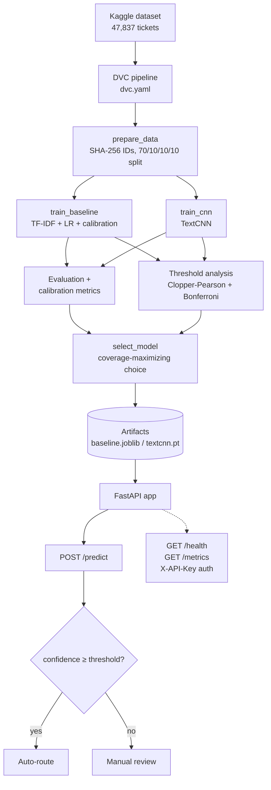

# IT Service Ticket Classification & Confidence-Based Routing

[](https://github.com/phongisnoob/it-service-ticket-classification/actions/workflows/ci.yml)

[](LICENSE)

An end-to-end ML system that classifies IT service tickets into eight support
categories and routes them automatically **only when the model is confident
enough**. Low-confidence tickets are escalated to human review instead of being
routed on a guess.

**Live demo:** [it-service-ticket-classification.onrender.com](https://it-service-ticket-classification.onrender.com)
· [API docs](https://it-service-ticket-classification.onrender.com/docs)
(`POST /predict` requires an `X-API-Key`; see [API example](#api-example).)

## Why confidence-aware routing?

A classifier can be accurate overall and still be unsafe to automate on
ambiguous tickets. Overall accuracy says nothing about *which individual
predictions* deserve trust.

This project therefore treats routing as a decision problem with two competing
quantities:

- **Coverage** — the share of tickets routed without a human.
- **Auto-routed accuracy** — how often those automatic decisions are correct.

A confidence threshold separates the two regimes:

```text
ticket → classifier → confidence → threshold gate
                                     ├─ confidence ≥ threshold → auto-route
                                     └─ confidence < threshold → manual review
```

The threshold is not hand-picked. It is selected statistically so that
auto-routed accuracy holds at 90% or better with a chosen confidence level,
and coverage is maximized subject to that constraint (see
[Threshold selection](#threshold-selection)).

## Model performance

Held-out test set, 4,787 tickets (values from `reports/metrics/`):

| Model | Accuracy | Macro F1 | Weighted F1 |
|---|---|---|---|
| **TF-IDF + Logistic Regression** (production) | **85.75%** | **85.73%** | **85.78%** |
| TextCNN (experimental) | 84.17% | 84.30% | 84.20% |

The classical baseline won on validation coverage and is the model deployed by
`model_selection.json`. The TextCNN is kept as a comparable experimental
candidate.

## Calibration

Predicted probabilities are only useful for routing if they are *calibrated* —
a "70% confidence" prediction should be right about 70% of the time. Two
separate mechanisms are used, deliberately:

1. **Training-time calibration** — the baseline wraps
   `TF-IDF + LogisticRegression` in `CalibratedClassifierCV` (sigmoid method,
   5-fold cross-validation *on the training split*). This produces honest
   probabilities from a single fit.
2. **Held-out calibration evaluation** — a dedicated calibration partition
   (never seen during training or threshold selection) measures how honest the
   probabilities actually are:

   | Metric | Baseline |
   |---|---|
   | Expected Calibration Error (ECE) | 0.082 |
   | Brier score (top label) | 0.104 |

Do not confuse the CV inside `CalibratedClassifierCV` (part of training) with
the separate calibration partition (evaluation only). They answer different
questions.

## Threshold selection

The production threshold is selected on the **tune set**, never on test data:

- Candidate grid: 0.10 → 1.00 in 0.01 steps (90 candidates).
- For each candidate, compute a **simultaneous Clopper–Pearson lower
  confidence bound** on auto-routed accuracy at α = 0.05, with a **Bonferroni
  correction** across all candidates.
- A candidate must route at least 50 tune-set tickets to be eligible.
- Among eligible candidates, pick maximum **coverage** subject to the lower
  bound being ≥ 90%.

Selected threshold: **0.57**
(`reports/metrics/baseline_selected_threshold.json`). Because selection happens
on tune data, the statistical guarantee applies there; the numbers below are
held-out test-set observations, not guarantees.

## Test-set routing results

| Metric (baseline, threshold 0.57) | Value |
|---|---|
| Overall accuracy | 85.75% |
| Auto-route coverage | 82.56% |
| Accuracy on auto-routed tickets | 92.16% |
| Sent to manual review | 17.44% |
| Auto-routed tickets | 3,952 / 4,787 |

## Architecture



The API serves a small built-in UI at `/` for interactive classification, and
`GET /model-info` exposes the persisted evaluation metrics shown in the UI.

## MLOps & reproducibility

**DVC** versions every stage of the pipeline (`dvc.yaml`, `dvc.lock`):
data preparation, training, evaluation, threshold analysis, model selection.
Reproduce any stage with `dvc repro` and inspect results with
`dvc metrics show`. Artifacts are stored on an S3-compatible remote (DagsHub)
and fetched with `dvc pull`.

**MLflow** tracks parameters, metrics, and artifacts for each training run via
`src/tracking.py`. Tracking is environment-driven: it writes to a local SQLite
store (`mlruns.db`) by default and is disabled entirely in CI
(`MLFLOW_TRACKING_ENABLED=false`). Point `MLFLOW_TRACKING_URI` at a real server
for production use.

**Artifact integrity:** every trained model's SHA-256 is recorded, and the
threshold configuration stores the hash of the exact model that produced it.
The API validates both at startup and refuses to serve if they disagree — so a
model can never be served with someone else's threshold. The TextCNN bundle
(weights, vocab, labels, config) carries its own verified manifest.

## Observability

The service exposes Prometheus metrics at `/metrics`:

- `http_requests_total` / `http_request_duration_seconds` — volume and latency
  per route template
- `prediction_requests_total` — classification volume
- `auto_route_total` / `manual_review_total` — routing behavior over time
- `prediction_confidence` — live confidence distribution

Unmatched URL paths are collapsed to an `UNMATCHED` label so request
cardinality cannot grow without bound.

## Security

- `X-API-Key` authentication on `/predict`; the comparison is constant-time
  (`secrets.compare_digest`). A key is mandatory when `APP_ENV=production`.
- PyTorch weights are loaded with `weights_only=True`.
- Input validation: 3–5,000 characters after whitespace normalization; blank
  and oversized requests are rejected with 422.
- Model/threshold SHA-256 binding validated before serving (see above).
- Covered by dedicated hardening tests (`tests/test_api_hardening.py`).

No credentials are stored in the repository; all secrets are runtime
environment variables or local-only files (`dvc remote modify --local`,
`.env`).

## CI

GitHub Actions runs on every push to `main`:

1. **lint-and-test** — install pinned dependencies → `pip check` → `ruff` →
   `mypy --strict` → `pytest`
2. **artifact-integration** — `dvc pull` from the DagsHub remote → verify
   artifact hashes against threshold configs → run integration tests
3. **docker-build-and-test** — build baseline and CNN images, start them with
   real credentials, wait for `/health`, then exercise `/predict` end-to-end

This is CI only — deployment happens separately (Render rebuilds from the
repository image).

## Docker

Two image variants; both pull model artifacts at container startup from the
DVC remote, so credentials are runtime environment variables — never baked
into the image:

```bash
# baseline (production default)
docker build -t it-ticket-classifier:baseline --build-arg MODEL_BACKEND=baseline .

# TextCNN backend
docker build -t it-ticket-classifier:cnn --build-arg MODEL_BACKEND=cnn .
```

Run:

```bash
docker run --rm -p 8000:8000 \
  -e APP_ENV=production \
  -e API_KEY=<your-key> \
  -e DAGSHUB_TOKEN=<token> \
  it-ticket-classifier:baseline
```

- Exposes port **8000** (`/health` for readiness).
- `DAGSHUB_TOKEN` (or `AWS_ACCESS_KEY_ID`/`AWS_SECRET_ACCESS_KEY`) is required
  for the startup `dvc pull`; the container exits with a clear error if the
  pull fails. Details: [docs/deploy.md](docs/deploy.md).

## Quickstart

```bash
# 1. Clone
git clone https://github.com/phongisnoob/it-service-ticket-classification.git
cd it-service-ticket-classification

# 2-3. Environment + dependencies (Python 3.12)
python -m venv .venv
.venv\Scripts\activate            # Windows   (source .venv/bin/activate on macOS/Linux)
pip install --require-hashes -r requirements-dev.txt

# 4. Dataset — download from Kaggle and place it here:
#    https://www.kaggle.com/datasets/adisongoh/it-service-ticket-classification-dataset
#    expected path: data/raw/all_tickets_processed_improved_v3.csv

# 5. Reproduce the pipeline (needs DagsHub credentials for artifact pulls)
dvc remote modify dagshub --local access_key_id "$DAGSHUB_TOKEN"
dvc remote modify dagshub --local secret_access_key "$DAGSHUB_TOKEN"
dvc pull                          # fetch pre-trained artifacts, or:
dvc repro                         # re-run training/evaluation from scratch

# 6. Run the API
set APP_ENV=development           # export APP_ENV=development on macOS/Linux
python -m uvicorn app.main:app --reload

# 7-8. Verify
curl http://127.0.0.1:8000/health
```

```bash
# 9. Tests
python -m pytest -v

# 10. Optional: MLflow UI over the local tracking database
mlflow ui --backend-store-uri sqlite:///mlruns.db
```

## API example

```bash
curl -X POST https://it-service-ticket-classification.onrender.com/predict \
  -H "Content-Type: application/json" \
  -H "X-API-Key: $API_KEY" \
  -d '{"text": "I cannot access my account and need my password reset"}'
```

Response shape:

```json
{
  "category": "Access",
  "confidence": 0.93,
  "threshold": 0.57,
  "needs_manual_review": false,
  "top_3": [
    {"category": "Access", "probability": 0.93},
    {"category": "Administrative rights", "probability": 0.04},
    {"category": "Hardware", "probability": 0.02}
  ]
}
```

Values above are illustrative; `confidence`, `threshold`, and `top_3`
probabilities come straight from the calibrated model at request time.

## Project structure

```text
app/                 FastAPI application + built-in UI (static/)
src/                 pipeline code: data, training, evaluation,
                     routing_utils.py (Clopper-Pearson thresholds),
                     inference.py (Baseline/CNN backends)
tests/               66 tests: API contract, security, ML smoke,
                     split integrity, validation design, integration
artifacts/           trained models (DVC-tracked, gitignored binaries)
reports/             metrics, figures, persisted split IDs
docs/deploy.md       deployment guide (Render env vars)
dvc.yaml / dvc.lock  reproducible pipeline definition
params.yaml          model + routing hyperparameters
Dockerfile           baseline/CNN images with startup artifact pull
```

## Engineering highlights

- **Statistical risk control for automation** — routing threshold chosen via
  simultaneous exact Clopper–Pearson bounds with Bonferroni correction, not a
  guessed cutoff.
- **Calibrated probabilities** — `CalibratedClassifierCV` at train time,
  ECE/Brier measured on a separate calibration partition.
- **Human-in-the-loop by design** — the model abstains on low-confidence
  tickets instead of guessing; the UI makes this visible per prediction.
- **Reproducibility** — full DVC pipeline, lock file, remote artifacts;
  MLflow tracking behind an env-driven switch.
- **Artifact integrity** — SHA-256 binding between models and their thresholds,
  validated at startup and in CI.
- **Production hygiene** — strict mypy, ruff, hash-pinned dependencies,
  Prometheus metrics, keyed auth with constant-time comparison, Docker
  variants smoke-tested in CI.

## Limitations

- The dataset is public and IT-service specific; vocabulary and class balance
  may not transfer to other helpdesks.
- Test-set metrics are retrospective observations. Under distribution drift,
  calibration quality and the tune-selected threshold can degrade — monitor
  both against live outcomes.
- Manual review remains genuinely necessary for ambiguous tickets; coverage
  cannot reach 100% without giving up the accuracy guarantee.
- MLflow tracking defaults to a local SQLite database, which is convenient for
  development but not a production tracking server.

## Contributing

This is a solo project, so there's no contribution workflow to speak of. If you
fork or reuse it, keep the raw dataset and model binaries out of git and run
`python -m pytest -v` before sharing changes.

## Maintainer

Built and maintained by me ([@phongisnoob](https://github.com/phongisnoob)) as
a personal project.

## License

[MIT](LICENSE) © 2026 Doan Tuan Phong
